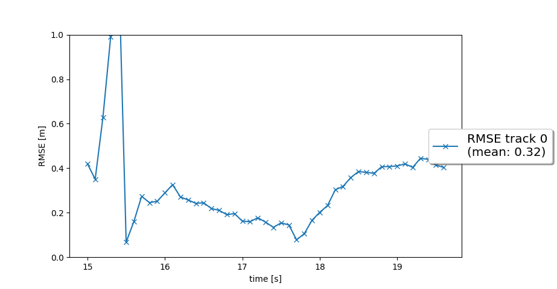
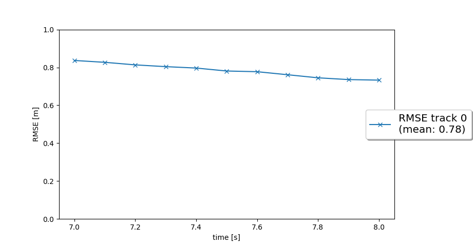
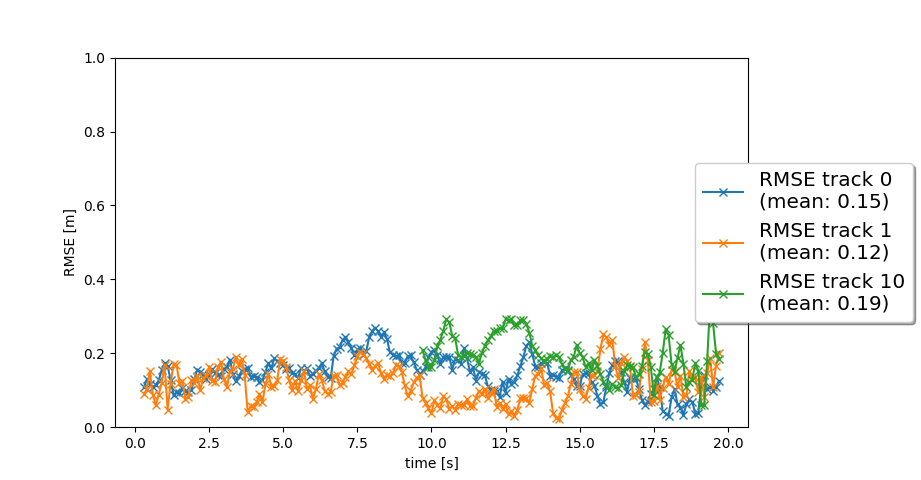
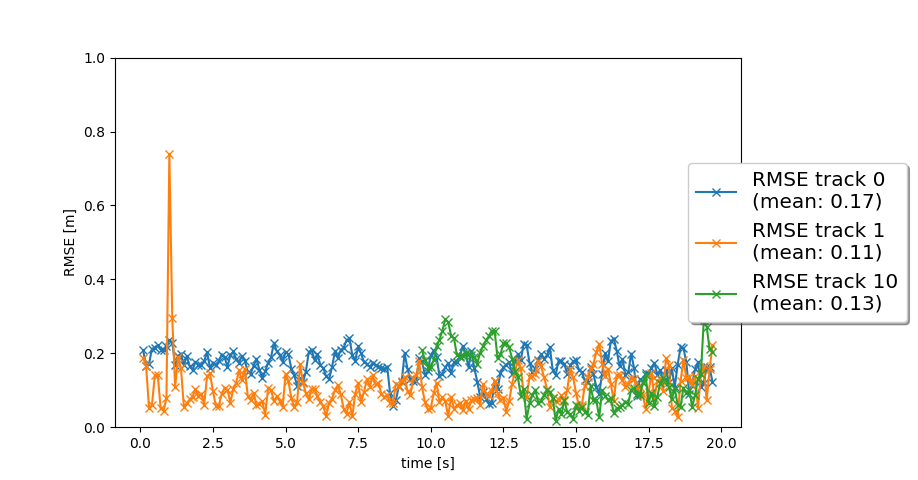
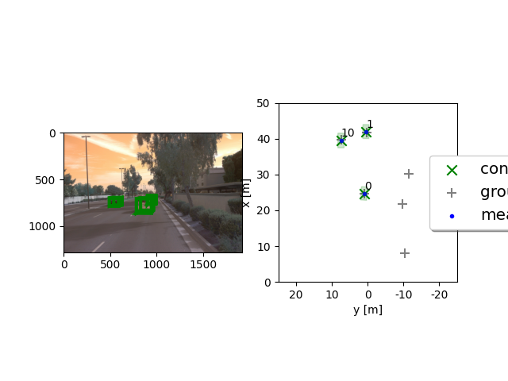

# Writeup: Track 3D-Objects Over Time

Please use this starter template to answer the following questions:

### 1-1. Write a short recap of the four tracking steps and what you implemented there (filter, track management, association, camera fusion). Which results did you achieve?

#### Filter

Using Extended Kalman Filter (EKF) with 6-dim state vector (x, y, z, vx, vy, vz),
it can estimate target position.

Step1 result:

#### Track management

Added State ('initialized' / 'tentative' / 'confirmed') and Score to each target.
Becasue it needs high Score to change state from 'tentative' to 'confirmed',
it can remove False Positive noise.
Also, Becasue only low Score taget will be deleted,
it can remove False Negative noise.

Step2 result:

#### Association

Using single nearest neighbor data association,
it can treat mulitple target.
The track and measurement pair with lowest Mahalanobis distance will be associated.
In addition to this, only the pair which passed chi-square-distribution can be associated.

Step3 result:

#### Camera fusion

It Assosiates track and camera measurement in addition to association between track and Lidar measurement.
As result of these tow associations, Lidar detection and Camera detection are fused.

Step4 result:

Step4 result movie:
[[my_tracking_results.avi]](img2/my_tracking_results.avi)

### 1-2. Which part of the project was most difficult for you to complete, and why?

As far as this report, there are no strong difficulties
because it is theorized and there are many guides.

If I make more acurate filter,
most difficult point is how to treat non-Gaussian distribution.
EKF assume the distribution is independent in time sequence,
but usualy detection error have strong dependency (including systematic error) along time sequence.
To treat this error, I need to think non-theorized method.

### 2. Do you see any benefits in camera-lidar fusion compared to lidar-only tracking (in theory and in your concrete results)? 

In theory, EKF with more measurement can estimate more accurate result even if the error of the measurement is larger.
In Step4 result, Camera fusion result of RMSE of track #1 and #10 is better than Lidar-only detection.

However, this can be ture only when the camera detection error has Gaussian distribution.
If camera detection has large systematic error, using only Lidar will be one of the options.

### 3. Which challenges will a sensor fusion system face in real-life scenarios? Did you see any of these challenges in the project?

Tracking or sensor fusion need a few frames to decide that the detection is 'confirmed'.
However, detection latency is very important to avoid collision.
In this project, the same issue can be found.

To inprove it, one choice is making weak vehicle control (breaking) for 'tentative' target.
Improving detection accuracy and reducing Score threashold to 'confirmed' is also good countermeasure.

### 4. Can you think of ways to improve your tracking results in the future?

Good estimation of distribution shape (sigma) makes good accuracy when using EKF.
Calcurate sigma using equations and theories is one choice.
Estimate it through vehicle evaluation is another choice.
Also, it can be calucurated using Machin Learning method.

