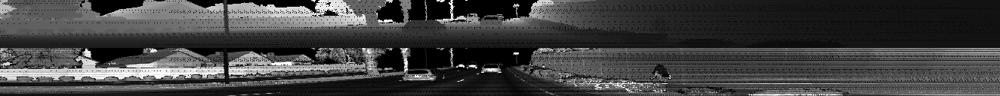

# Writeup: Track 3D-Objects Over Time

## Visualize point-cloud (ID_S1_EX2)

### Find 10 examples of vehicles with varying degrees of visibility in the point-cloud

1_000

1_050

1_100

1_150

2_000

2_075

2_150

3_000

3_075

3_150

### Try to identify vehicle features that appear stable in most of the inspected examples and describe them

Usually, 2 faces near to ego-vehicle (like L-shape in BEV) can find.
However, sometimes only 1 face can find, (e.g. the vehicle on same lane as ego-vehicle).

License plate and brake lamp have high reflection.
Body plate and bumper have middle reflection.
Window glass has low reflection (or no reflection).

### Compute precision and recall (ID_S4_EX3)

 - data_filename : `training_segment-1005081002024129653_5313_150_5333_150_with_camera_labels.tfrecord`
 - show_only_frames : `[50, 150]`
 - model : `fpn_resnet`
 - min_iou : `0.5`

X, Y error is approx. +-20cm.

Z error is approx +60cm ~ +80cm.
It seems it has datum offset.

#### Verify

 - configs_det.use_labels_as_objects : `True`

Using labels as detections, precision and recall is exacactly same as 1.0.
